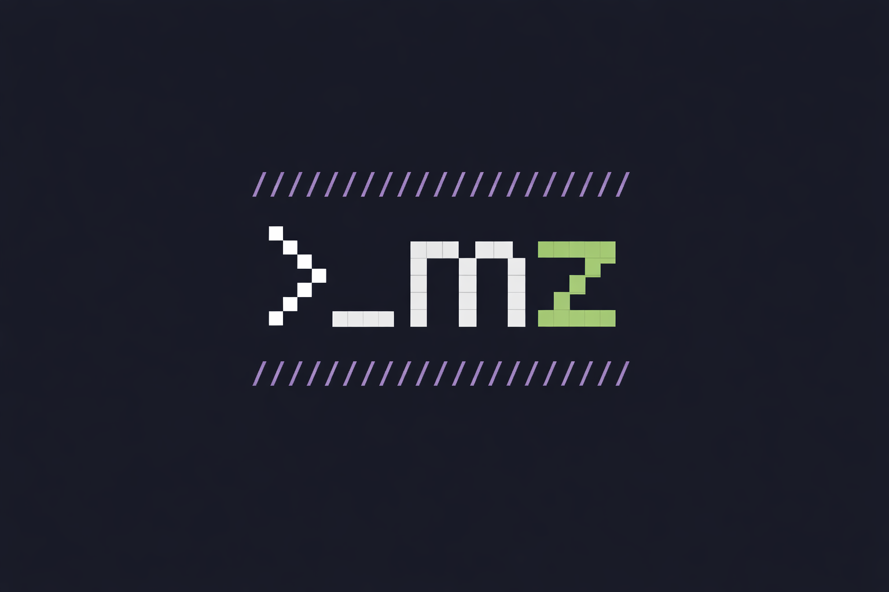

# mlz.no

<div align="center">



### Personal portfolio — built as an interactive terminal

[](https://mlz.no)
[](./LICENSE)
[](https://react.dev)
[](https://www.typescriptlang.org)
[](https://vitejs.dev)

</div>

---

## About

A terminal-style personal homepage for **Martin Zachariassen** — back-end developer with 9 years of experience in architecture, integrations and production services. Instead of a traditional portfolio layout, everything is navigated through typed commands: `about`, `experience`, `skills`, `links`, and more.

Built with **React**, **TypeScript** and **Vite**. Styled with a [Tokyo Night](https://github.com/enkia/tokyo-night-vscode-theme) colour palette. No CSS framework — just design tokens and plain CSS.

---

## Getting started

```bash
# Install dependencies
npm install

# Start dev server
npm run dev

# Type-check
npm run typecheck

# Production build
npm run build
```

---

## Commands

Type `help` in the terminal to see all available commands. Type `help --secret` for more.

| Command | Description                                      |
|---|--------------------------------------------------|
| `help` | Show available commands                          |
| `about` | Who I am                                         |
| `skills` | Areas of focus & interests                       |
| `experience` | Work history                                     |
| `contact` | How to reach me                                  |
| `links` | GitHub, LinkedIn, homepage                       |
| `open <target>` | Open a link - `github` · `linkedin` · `homepage` |
| `whoami` | Who is this?                                     |
| `ls` / `ls -la` | List "files"                                     |
| `pwd` | Print working directory                          |
| `clear` | Clear the screen                                 |
| `matrix` | 👀                                               |

---

## Project structure

```
src/
├── App.tsx
├── main.tsx
├── vite-env.d.ts
├── components/
│   ├── NameHeader/
│   │   ├── NameHeader.tsx     # Name + tagline header shown above the terminal
│   │   └── NameHeader.css
│   └── Terminal/
│       ├── Terminal.tsx       # Main terminal component
│       ├── Terminal.css
│       ├── components/
│       │   ├── OutputLine.tsx  # Renders a single output line
│       │   ├── OutputLine.css
│       │   └── TerminalPrompt.tsx  # Input prompt component
│       ├── hooks/
│       │   ├── useBanner.ts        # Boot banner logic
│       │   ├── useCommandRunner.ts # Command dispatch
│       │   ├── useEasterEggs.ts    # Easter egg triggers
│       │   ├── useResize.ts        # Drag-to-resize (desktop only)
│       │   ├── useViewport.ts      # Viewport size tracking
│       │   └── useViewportEvents.ts
│       └── state/
│           └── terminalReducer.ts  # Terminal state management
├── easter/
│   ├── MatrixOverlay.tsx      # Matrix rain canvas effect
│   ├── MatrixOverlay.css
│   └── useKonami.ts           # Konami code listener
├── styles/
│   └── global.css             # Design tokens, reset, global styles
└── terminal/
    ├── parseCommand.ts        # Input parser
    ├── text.ts                # Linkify utility
    └── commands/
        ├── index.ts           # Command registry
        ├── types.ts           # Shared command types
        ├── about.ts
        ├── contact.ts
        ├── easter.ts
        ├── experience.ts
        ├── focus.ts
        ├── help.ts
        ├── system.ts
        └── tech/
            ├── index.ts
            ├── backend.ts
            ├── build.ts
            ├── data.ts
            ├── ops.ts
            ├── platform.ts
            └── testing.ts

public/
├── favicon.ico / favicon*.png # All favicon sizes
├── apple-touch-icon.png
├── icon-192.png / icon-512.png
├── site.webmanifest           # PWA manifest
├── robots.txt
├── sitemap.xml
└── .nojekyll                  # Prevents Jekyll processing on GitHub Pages

scripts/
└── generate-favicons.mjs      # Generates all favicon sizes from favicon.png
```

---

## Tech stack

| Area | Technology                                                            |
|---|-----------------------------------------------------------------------|
| Framework | [React 19](https://react.dev)                                         |
| Language | [TypeScript 5](https://www.typescriptlang.org)                        |
| Build tool | [Vite 7](https://vitejs.dev)                                          |
| Styling | Plain CSS with design tokens - no framework                           |
| Font | [JetBrains Mono](https://www.jetbrains.com/lp/mono/) via Google Fonts |
| Hosting | [GitHub Pages](https://pages.github.com)                              |
| Analytics | [Umami](https://umami.is) - cookieless, GDPR-compliant, self-hosted   |

---

## Deployment

Deployments are triggered by **publishing a GitHub Release**. The workflow automatically:

1. Checks out `main`
2. Sets `VITE_APP_VERSION` from the release tag (shown in the boot sequence)
3. Fetches the latest Umami analytics script
4. Builds with Vite (Terser, vendor chunk splitting, `es2022` target)
5. Deploys to GitHub Pages via `actions/deploy-pages`

**To release a new version:**

```bash
# 1. Merge your work to main
# 2. Go to GitHub → Releases → Draft a new release
# 3. Create a new tag (e.g. v1.2.0), target main, publish
# → Deployment starts automatically
```

Manual deploys are also available under **Actions → Deploy to GitHub Pages → Run workflow**.

---

## Scripts

| Script | Description |
|---|---|
| `npm run dev` | Start local dev server |
| `npm run build` | Type-check + production build |
| `npm run typecheck` | Run TypeScript compiler check only |
| `npm run preview` | Preview the production build locally |
| `npm run generate-favicons` | Regenerate all favicon sizes from `public/favicon.png` |

---

## Accessibility & performance

- WCAG AA colour contrast throughout
- Skip-to-content link for keyboard users
- `role="log"` + `aria-live="polite"` on terminal output
- All interactive elements have descriptive `aria-label`
- `:focus-visible` styles for keyboard navigation
- Non-blocking font loading (`media="print"` swap trick)
- Vendor chunk splitting for better cache utilisation
- Self-hosted Umami script — no third-party DNS lookup
- `color-scheme: dark` to prevent flash of white on load
- `contain: layout paint` on terminal for paint isolation

---

## Browser support

Modern browsers only - Chrome, Firefox, Safari, Edge (last 2 versions).  
No IE11, no legacy polyfills. Build target: `es2022`.

---

## Contributing

This is a personal site - PRs are not expected.  
Feel free to fork it and use it as inspiration for your own terminal portfolio.

---

## License

[MIT](./LICENSE) © 2026 Martin Zachariassen

